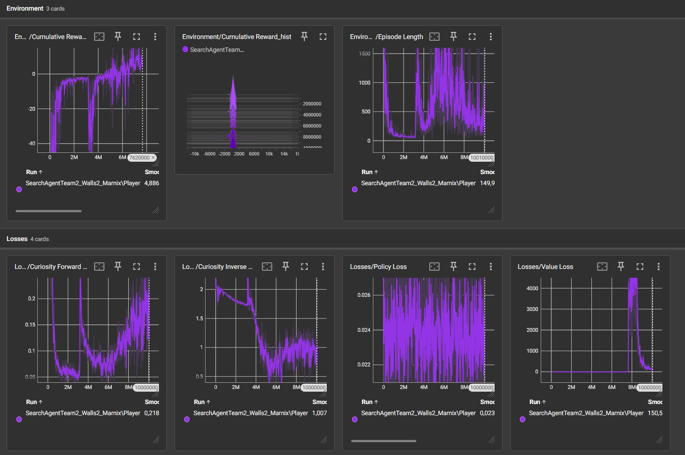

# Team Hide & Seek

Ons project draait allemaal rond het teamwerk van AI's en het vinden van een target in een veld omringd door muren. We werken hier niet met normale principes, onze opdracht bestudeert ook het teamwerk van deze modellen en hiermee hebben we ondervonden dat dit zeer goed werkt.

## Samenvatting

Hierin wordt uitgelegd hoe we dit project hebben opgebouwd en welke methoden we hebben gebruikt om tot dit resultaat te komen. Men kan hiermee bijleren over ml agents en hoe deze in team kunnen werken om efficiënter te leren.

## TeamManager

Onze TeamManager zorgt voor eenvoudig beheer van onze teams, hierbij worden alle agents in een lijst geplaatst en kunnen we gezamelijk hierop acties uitvoeren.

### Awake

Deze functie zorgt voor een globaal toeganspunt voor de klasse, dit laat andere scripts (zoals SearchAgentTeam) toe om deze klasse te referenen in zijn script.

```csharp
 private void Awake()
{
    Instance = this;
}
```

### Registreren van agents

De eerste stap die we uitvoeren is het registreren van agenten en deze dus in een lijst steken, hier checken we eerst of de agent zich nog niet in de lijst bevind en dan pas voegen we deze toe.

```csharp
public void RegisterAgent(SearchAgentTeam agent)
{
    if (!agents.Contains(agent))
        agents.Add(agent);
}
```

### Rewards op teamniveau

Om de teamlogica in het project te houden geven we dus ook rewards op teambasis, als iemand iets slecht doet of eerder iets goed krijgt iedereen deze reward, ongeacht of dat een agent dit apart goed of slecht doet.

```csharp
public void GiveTeamReward(float reward)
{
    foreach (var agent in agents)
    {
        agent.AddReward(reward);
    }
}
```

### EndEpisode op teambasis

Omdat het team dus samenwerkt, moeten alle agents op hetzelfde moment een nieuwe episode starten en beindigen, hierdoor hebben we een functie gemaakt die deze allemaal tegelijk zal beindigen.

```csharp
public void EndTeamEpisode()
{
    foreach (var agent in agents)
    {
            agent.EndEpisode();
    }
}
```

### Lijst van agents

Ook hebben we een functie aangemaakt die de lijst van actieve agents zal teruggeven, met deze lijst kan je alle agents allemaal ook beheren (apart) als dit nodig is.

```csharp
public List<SearchAgentTeam> GetAgents()
{
    return agents;
}
```

## SearchAgentTeam

Dit script word gebruikt op elke agent en zorgt voor de effectieve functionaliteit van de AI zelf, we hebben met veel trial en error de rewards ook kunnen aanpassen voor het meest efficient gebruik.

### Start 

Deze functie zorgt voor het configureren van het Rigidbody van de agent, hierbij word er ook voor gezorgd dat het niet door objecten gaat en we gebruiken hierbij ook een andere vorm van collison detection voor (door ons ondervonden) betere prestaties.

```csharp

void Start()
{
    rb = GetComponent<Rigidbody>();

    rb.interpolation = RigidbodyInterpolation.Interpolate; // Voorkomt tunneling
    rb.collisionDetectionMode = CollisionDetectionMode.ContinuousDynamic; // Betere collision detection
}
```

### Update

In de Update functie zorgen we ervoor dat we de zones aanmaken per agent, dit is dus de plaats waar ze pattroeieren en zullen zoeken voor het target. We visualiseren dit ook op unity zelf voor een beetje duidelijkheid en overzicht.  

```csharp
void Update()
{
    if (hasAssignedZone && assignedSearchZone != Vector3.zero)
    {
        // Teken lijn naar zone
        Debug.DrawLine(transform.position, assignedSearchZone, Color.red, 0.1f);

        // Teken een kruis op de zone locatie voor betere visualisatie
        Vector3 zonePos = assignedSearchZone;
        Debug.DrawLine(zonePos + Vector3.left * 2f, zonePos + Vector3.right * 2f, Color.yellow, 0.1f);
        Debug.DrawLine(zonePos + Vector3.forward * 2f, zonePos + Vector3.back * 2f, Color.yellow, 0.1f);

        // Teken cirkel rond de zone
        DrawCircle(zonePos, 5f, Color.green);
    }
}
```

### CollectObservations 

Een van de meest cruciale functies voor onze agent, dit zal onze observaties verzamelen, de observaties dat deze agent zal onvangen zijn:

- eigen positie
- eigen snelheid
- richting naar doel
- afstand tot doel
- richting naar zoekzone
- afstand tot zoekzone
- richting naar teammate
- afstand tot teammate

```csharp
public override void CollectObservations(VectorSensor sensor)
{
    // Agent state (3 + 3 = 6 observations)
    sensor.AddObservation(transform.localPosition);
    sensor.AddObservation(rb.linearVelocity);

    // Target information (3 + 1 = 4 observations)
    Vector3 toTarget = targetPosition.position - transform.position;
    sensor.AddObservation(toTarget.normalized);
    sensor.AddObservation(toTarget.magnitude / maxSearchDistance);

    // Assigned search zone informatie (4 observations)
    if (hasAssignedZone)
    {
        Vector3 toZone = assignedSearchZone - transform.position;
        sensor.AddObservation(toZone.normalized);
        sensor.AddObservation(toZone.magnitude / maxSearchDistance);
    }
    else
    {
        sensor.AddObservation(Vector3.zero);
        sensor.AddObservation(0f);
    }

    // Team coordination (for each teammate: 3 + 1 = 4 per teammate)
    foreach (var teammate in TeamManager.Instance.GetAgents())
    {
        if (teammate != this)
        {
            Vector3 toMate = teammate.transform.position - transform.position;
            sensor.AddObservation(toMate.normalized);
            sensor.AddObservation(toMate.magnitude / maxTeamDistance);
        }
    }
}
```

### OnActionReceived

De belangrijkste functie in onze code, deze functie zorgt voor de beweging en de correcte rewards, de rewards dat we geven aan de agent zijn als volgt:

- straf per stap (klein) 
- beloning om dichter bij doel te komen
- straf als agent weg is van zone
- kleine beloning als agent dicht bij zoekzone is 
- straf voor kleine spreiding van team
- straf voor vrijwel geen beweging 
- kleine beloning voor beweging 
- belonging voor verkenningspatroon 
- obstakel navigatie reward 
- grote straf als agent af veld valt 

```csharp
public override void OnActionReceived(ActionBuffers actionBuffers)
{
    AddReward(-0.001f); // Kleine straf per stap, zo blijft de agent niet doelloos rondlopen


    float pathDistanceToTarget = GetPathDistanceToTarget();
    float deltaPath = previousPathDistance - pathDistanceToTarget;
    AddReward(deltaPath * 0.1f);
    previousPathDistance = pathDistanceToTarget;


    if (hasAssignedZone)
    {
        float distanceToZone = Vector3.Distance(transform.position, assignedSearchZone);
        float normalizedZoneDistance = distanceToZone / maxSearchDistance;

        AddReward(-normalizedZoneDistance * 0.002f);

        if (distanceToZone < 20f)
        {
            AddReward(0.005f);
        }
    }

    float teamSpread = CalculateTeamSpread();
    if (teamSpread < 20f)
    {
        AddReward(-0.001f);
    }

    float movementMagnitude = Mathf.Abs(actionBuffers.ContinuousActions[0]) + Mathf.Abs(actionBuffers.ContinuousActions[1]);
    if (movementMagnitude < 0.1f)
        AddReward(-0.001f); // Stronger penalty for not moving
    else
    {
        AddReward(0.0001f);
    }

    RewardExplorationPattern();

    Vector3 controlSignal = Vector3.zero;
    controlSignal.z = actionBuffers.ContinuousActions[0];
    Vector3 movement = transform.forward * controlSignal.z * speedMultiplier;
    rb.MovePosition(rb.position + movement * Time.fixedDeltaTime);

    float rotation = rotationMultiplier * actionBuffers.ContinuousActions[1];
    Quaternion turn = Quaternion.Euler(0.0f, rotation, 0.0f);
    rb.MoveRotation(rb.rotation * turn);

    RewardObstacleNavigation();

    episodeTimer += Time.fixedDeltaTime;


    if (transform.localPosition.y < -2)
    {
        TeamManager.Instance.GiveTeamReward(-1f);
        TeamManager.Instance.EndTeamEpisode();
    }
}
```

### RewardExplorationPattern

Deze functie zal ervoor zorgen dat de agent een negatieve reward krijgt als deze te dicht is bij een teammate, hierdoor zal er geen grote groep van agents ontstaan.

```csharp
private void RewardExplorationPattern()
{
    var teammates = TeamManager.Instance.GetAgents();

    // Beloon spreiding over de kaart
    foreach (var teammate in teammates)
    {
        if (teammate != this)
        {
            float distance = Vector3.Distance(transform.position, teammate.transform.position);

            if (distance < 15f)
            {
                AddReward(-0.005f);
            }
        }
    }
}
```

### OnCollisionEnter

Deze functie zal de logica van de speler aan te raken beheren, als de speler geraakt word zal de Episode beindigd worden (in teamverband) en zal het team ook een reward krijgen. Ook zal dit een extra reward aan de agent geven als de agent deze speler dicht bij de zone heeft aangeraak. Als de speler tegen een muur loopt zal deit gestraft worden.

```csharp
private void OnCollisionEnter(Collision collision)
{
    if (collision.gameObject.CompareTag("Enemy"))
    {
        if (hasAssignedZone)
        {
            float distanceToZone = Vector3.Distance(transform.position, assignedSearchZone);
            if (distanceToZone < 30f)
            {
                AddReward(0.5f);
            }
        }

        float timeReward = Mathf.Clamp01(1f - (episodeTimer / maxEpisodeTime)) * maxTimeReward;
        AddReward(timeReward);

        TeamManager.Instance.GiveTeamReward(2f);
        TeamManager.Instance.EndTeamEpisode();

    }
    else if (collision.gameObject.CompareTag("Wall"))
    {
        AddReward(-0.05f);
    }
}
```

### OnEpisodeBegin

Dit stuk code zal uitgevoerd worden bij elke nieuwe episode, dit zal de agents registreren in de TeamManager lijst, zal search zones aanmaken per agent en ook zorgen dat de environment deftig is ingesteld.

```csharp
public override void OnEpisodeBegin()
{
    episodeTimer = 0f;

    TeamManager.Instance.RegisterAgent(this);
    AssignSearchZone();

    InitializeEnvironment();
    previousPathDistance = GetPathDistanceToTarget();
}
```

### Heuristic 

Deze functie zal gebruikt worden bij de heuristic mode in unity zelf, hiermee kan je testen of de werking van de agents wel degelijk werkt voor je begint te trainen. We geven hier de basis acties mee.

```csharp
public override void Heuristic(in ActionBuffers actionsOut)
{
    Debug.Log("Heuristic mode actief!");

    var continuousActionsOut = actionsOut.ContinuousActions;
    continuousActionsOut[0] = Input.GetAxis("Vertical");
    continuousActionsOut[1] = Input.GetAxis("Horizontal");
}
```

### InitializeEnvironment

Zoals de naam van deze functie dit al weggeeft zal dit de omgeving volledig instellen voor geruik, dit word gedaan als een nieuwe episode word gestart. De functie zal de agent terug spawnen als deze van de map is gevallen en zal ook voor het target een goede spawnplek vinden op de NavMesh.

```csharp
private void InitializeEnvironment()
{
    targetPosition.gameObject.SetActive(true);

    if (transform.localPosition.y < -2)
    {
        SetSpawnPosition();
    }


    Vector3 randomNavMeshPos;
    bool validPositionFound = false;

    for (int i = 0; i < 10; i++) // probeer max 10 keer een geldige plek te vinden
    {
        Vector3 randomPoint = new Vector3(
            Random.Range(-48f, 48f),
            0f,
            Random.Range(-48f, 48f)
        );

        NavMeshHit hit;
        int walkableMask = NavMesh.GetAreaFromName("Walkable");
        if (NavMesh.SamplePosition(randomPoint, out hit, 1.5f, 1 << walkableMask))
        {
            randomNavMeshPos = hit.position;
            targetPosition.position = randomNavMeshPos + Vector3.up * 1.5f; // optillen zodat hij niet in de grond zit
            validPositionFound = true;
            break;
        }
    }

    if (!validPositionFound)
    {
        Debug.LogWarning("Kon geen geldige spawnpositie vinden voor het target op de NavMesh.");
        targetPosition.position = new Vector3(0f, 1.5f, 0f);
    }
}
```

### SetSpawnPosition

Deze functie zal zorgen voor de spawnpositie van de agents, afhankelijk van de grootte van het team zal dit een vaste locatie pakken of een circulaire spreiding. Het script kan dit dus geruiken door de TeamManager aan te spreken en de lijst van geristreerde agents af te gaan.

```csharp
private void SetSpawnPosition()
{
    var agents = TeamManager.Instance.GetAgents();
    int myIndex = agents.IndexOf(this);
    Vector3 spawnPosition;
    switch (myIndex)
    {
        case 0:
            spawnPosition = new Vector3(-20f, 1f, -20f);
            break;
        case 1:
            spawnPosition = new Vector3(20f, 1f, -20f);
            break;
        case 2:
            spawnPosition = new Vector3(-20f, 1f, 20f);
            break;
        case 3:
            spawnPosition = new Vector3(20f, 1f, 20f);
            break;
        default:
            // Voor meer dan 4 agents - circulaire spreiding
            float angle = (360f / agents.Count) * myIndex * Mathf.Deg2Rad;
            float spawnRadius = 25f;
            spawnPosition = new Vector3(
                Mathf.Cos(angle) * spawnRadius,
                1f,
                Mathf.Sin(angle) * spawnRadius
            );
            break;
    }

    transform.localPosition = spawnPosition;
    transform.localRotation = Quaternion.identity;

    Debug.Log($"Agent {myIndex} spawned at: {spawnPosition}");
}
```

### CalculateTeamSpread

Deze functie word geruikt voor de spreiding van het team te meten, hierdoor weten we dus hoe dicht op elkaar ze opereren.

```csharp
private float CalculateTeamSpread()
{
    float totalDistance = 0f;
    var teammates = TeamManager.Instance.GetAgents();

    foreach (var teammate in teammates)
    {
        if (teammate != this)
            totalDistance += Vector3.Distance(transform.position, teammate.transform.position);
    }

    return totalDistance / (teammates.Count - 1);
}
```

### DrawCircle

Met deze functie zullen we de cirkels tekenen in de unity editor, deze cirkels zijn wel alleen te zien in de scene view en zijn dus puur voor deugging purposes.

```csharp
private void DrawCircle(Vector3 center, float radius, Color color)
{
    int segments = 16;
    float angleStep = 360f / segments;

    for (int i = 0; i < segments; i++)
    {
        float angle1 = i * angleStep * Mathf.Deg2Rad;
        float angle2 = (i + 1) * angleStep * Mathf.Deg2Rad;

        Vector3 point1 = center + new Vector3(Mathf.Cos(angle1) * radius, 0, Mathf.Sin(angle1) * radius);
        Vector3 point2 = center + new Vector3(Mathf.Cos(angle2) * radius, 0, Mathf.Sin(angle2) * radius);

        Debug.DrawLine(point1, point2, color, 0.1f);
    }
}
```

### AssignSearchZone

Dit zorgt ervoor dat elke agent een aparte zoek zone krijgt, afhankelijk van de index van de agent (in de lijst van de TeamManager) zal deze een vaste zoek zone krijgen. Als er meer dan 4 zijn zal de dedefault zone verdeeld worden over het midden.

```csharp
private void AssignSearchZone()
{
    var agents = TeamManager.Instance.GetAgents();
    int myIndex = agents.IndexOf(this);

    if (agents.Count == 0)
    {
        Debug.LogWarning($"Geen agents gevonden in TeamManager voor zone assignment!");
        return;
    }

    // VERBETERDE zone toewijzing, meer gespreid over de kaart
    switch (myIndex)
    {
        case 0:
            assignedSearchZone = new Vector3(-35f, 0, -35f); // Northwest
            Debug.Log($"Agent {myIndex} (ID: {gameObject.name}) assigned to NORTHWEST zone: {assignedSearchZone}");
            break;
        case 1:
            assignedSearchZone = new Vector3(35f, 0, -35f);  // Northeast
            Debug.Log($"Agent {myIndex} (ID: {gameObject.name}) assigned to NORTHEAST zone: {assignedSearchZone}");
            break;
        case 2:
            assignedSearchZone = new Vector3(-35f, 0, 35f);  // Southwest
            Debug.Log($"Agent {myIndex} (ID: {gameObject.name}) assigned to SOUTHWEST zone: {assignedSearchZone}");
            break;
        case 3:
            assignedSearchZone = new Vector3(35f, 0, 35f);   // Southeast
            Debug.Log($"Agent {myIndex} (ID: {gameObject.name}) assigned to SOUTHEAST zone: {assignedSearchZone}");
            break;
        default:
            // Voor meer dan 4 agents
            float angle = (360f / agents.Count) * myIndex * Mathf.Deg2Rad;
            float radius = 40f;
            assignedSearchZone = new Vector3(
                Mathf.Cos(angle) * radius,
                0,
                Mathf.Sin(angle) * radius
            );
            Debug.Log($"Agent {myIndex} (ID: {gameObject.name}) assigned to RADIAL zone: {assignedSearchZone}");
            break;
    }

    hasAssignedZone = true;
    Debug.Log($"Zone assignment complete for {gameObject.name}:");
    Debug.Log($"  - Agent Index: {myIndex}");
    Debug.Log($"  - Total Agents: {agents.Count}");
    Debug.Log($"  - Assigned Zone: {assignedSearchZone}");
    Debug.Log($"  - Current Position: {transform.position}");
}
```

### RewardObstacleNavigation

Dit klein stukje code zorgt ervoor dat de agent ook getrained word op het ontwijken en afstand behouden van obstakels, hierbij krijgt het een reward als hij afstand van de obstakels houd maar krijgt hij ook een negatieve reward als hij te dicht komt bij deze objecten.

```csharp
private void RewardObstacleNavigation()
{
    float closestObstacleDistance = GetClosestObstacleDistance();

    if (closestObstacleDistance < 1f)
    {
        AddReward(-0.01f * (1f - closestObstacleDistance));
    }
    else if (closestObstacleDistance > 3f && closestObstacleDistance < 8f)
    {
        AddReward(0.001f);
    }
}
```

### GetClosestObstacleDistance

Deze functie word gebruikt in de functie hiervoor en zorgt dus voor de afstand te weten te komen van de obstakels.

```csharp
private float GetClosestObstacleDistance()
{
    float minDistance = float.MaxValue;
    float maxRayDistance = 100f;
    int raysPerDirection = 5;
    float maxDegrees = 80f;

    for (int i = 0; i < raysPerDirection; i++)
    {
        float angle = -maxDegrees / 2f + (maxDegrees / (raysPerDirection - 1)) * i;
        Vector3 direction = Quaternion.AngleAxis(angle, Vector3.up) * transform.forward;

        RaycastHit hit;
        if (Physics.Raycast(transform.position, direction, out hit, maxRayDistance))
        {
            if (hit.collider.CompareTag("Wall"))
            {
                minDistance = Mathf.Min(minDistance, hit.distance);
            }
        }
    }

    return minDistance == float.MaxValue ? maxRayDistance : minDistance;
}
```

### GetPathDistanceToTarget

Dit stukje code berekent de afstand tot het target, dit doet dit rekeninghoudend met een geldig pad op de navmesh en dus ook met obstakels.

```csharp
private float GetPathDistanceToTarget()
{
    NavMeshPath path = new NavMeshPath();
    if (NavMesh.CalculatePath(transform.position, targetPosition.position, NavMesh.AllAreas, path) && path.status == NavMeshPathStatus.PathComplete)
    {
        float distance = 0f;
        for (int i = 1; i < path.corners.Length; i++)
        {
            distance += Vector3.Distance(path.corners[i - 1], path.corners[i]);
        }
        return distance;
    }
    return maxSearchDistance; // Grote waarde als er geen pad is
}
```

## Training config

Onze training config is gebaseerd op de standaar config, de grootste aanpassingen en beslissing zijn:

- PPO algoritme 
- Geen training buffer 
- Training gebaseed op curiositeit
- Veel max steps

```csharp
behaviors:
  Player:
    trainer_type: ppo
    hyperparameters:
      batch_size: 1024
      buffer_size: 10240
      learning_rate: 1.0e-4
      beta: 1.0e-3
      epsilon: 0.2
      lambd: 0.95
      num_epoch: 4
      learning_rate_schedule: linear
      beta_schedule: constant
      epsilon_schedule: linear
    network_settings:
      normalize: true
      hidden_units: 256
      num_layers: 3
    reward_signals:
      extrinsic:
        gamma: 0.995
        strength: 1.0
      curiosity:
        gamma: 0.99
        strength: 0.01
    max_steps: 15000000
    time_horizon: 128
    summary_freq: 10000
    threaded: true
```

## Tensorboard resultaten



## Conclusie


